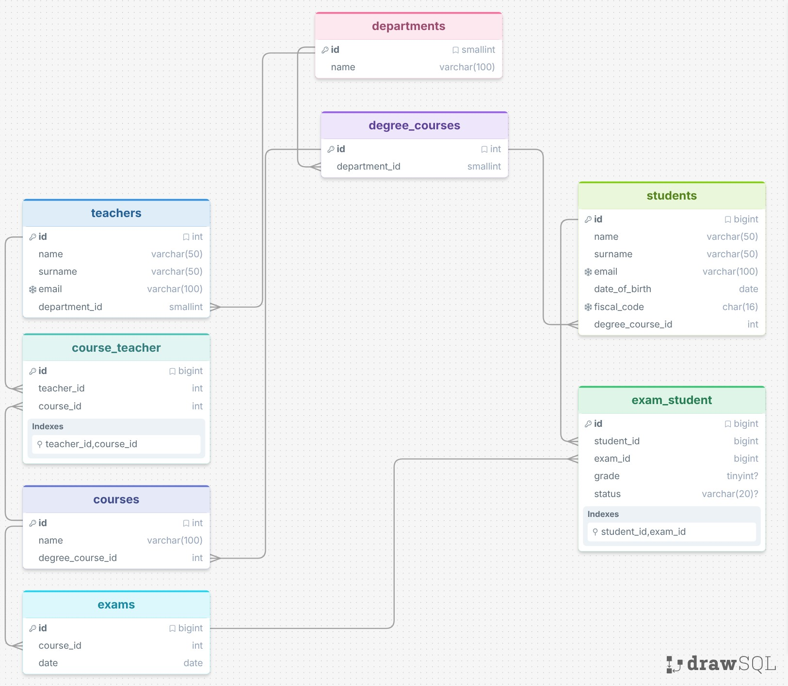

# Esercizio Database Università (`db-university`)

Questo README contiene lo schema del database per gestire le attività di un'università, sviluppato seguendo le specifiche richieste.

## Obiettivi raggiunti 

Ho modellato il database per soddisfare i seguenti requisiti:

- [x] Gestione dei **Dipartimenti**.
    
- [x] Collegamento tra **Dipartimenti e Corsi di Laurea**.
    
- [x] Struttura dei **Corsi** all'interno dei Corsi di Laurea.
    
- [x] Relazione molti-a-molti tra **Corsi e Insegnanti**.
    
- [x] Gestione degli **appelli d'Esame** per ogni corso.
    
- [x] Associazione degli **Studenti** a un solo Corso di Laurea.
    
- [x] Iscrizione degli **Studenti a più appelli** d'esame.
    
- [x] Memorizzazione del **voto** (anche insufficiente) per ogni esame.
    

## Schema del Database

## Note sulle scelte tecniche

- **Tabelle ponte:** Ho usato tabelle di supporto per collegare docenti/corsi e studenti/esami, mantenendo lo schema pulito e facile da leggere.
    
- **Voti:** I campi `grade` e `status` sono opzionali (`nullable`) per gestire correttamente l'iscrizione all'esame prima che venga dato il voto.
    
- **Integrità Dati:** Ho utilizzato vincoli `NOT NULL` per garantire la completezza delle informazioni e `UNIQUE` per evitare duplicati su email (studenti/docenti) e Codice Fiscale (studenti).

